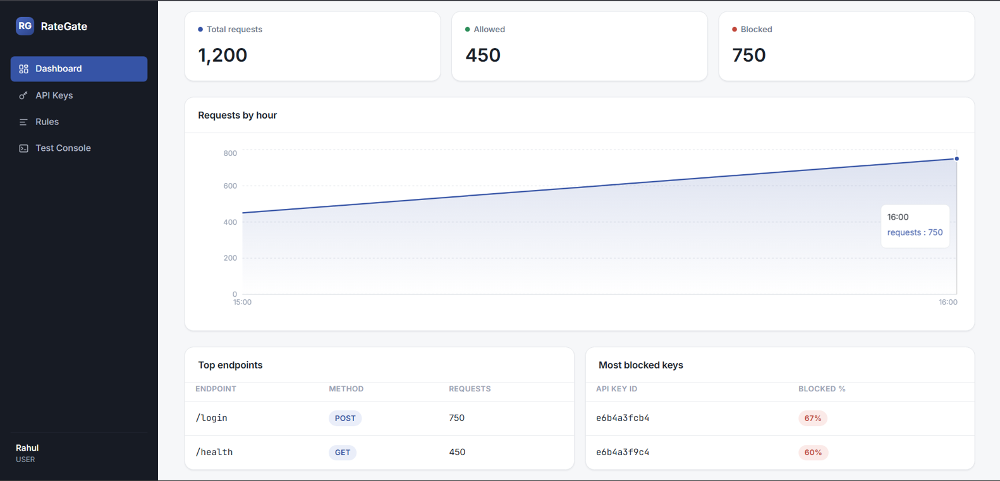
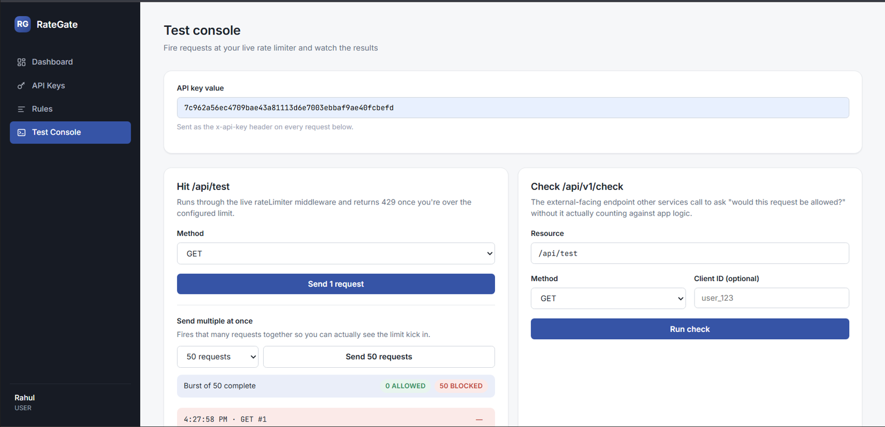
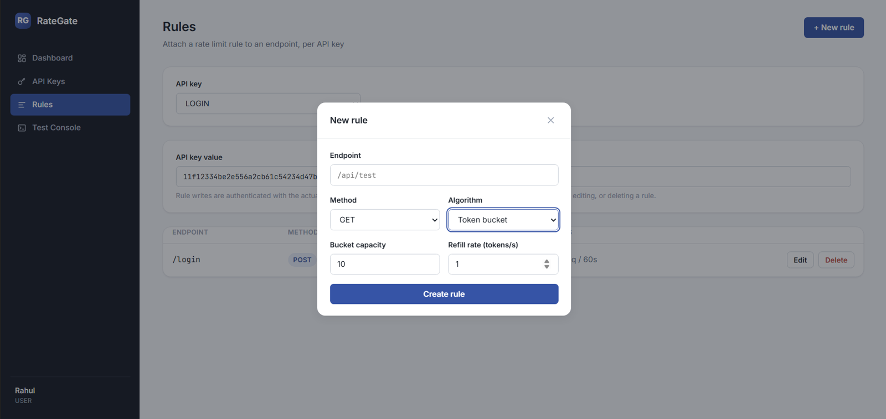

# 🚦 RateGate — API Rate Limiting Service

A developer-focused API rate limiting service that helps applications protect their endpoints from abuse, traffic spikes, and excessive requests.

RateGate provides API key authentication, configurable endpoint rules, Redis-backed request tracking, and real-time traffic analytics.

---

## 📸 Screenshots

### Dashboard



### API Key Management



### Rule Configuration



---

## ✨ Features

- 🔑 API key based application authentication
- ⚙️ Custom rate limits per endpoint and HTTP method
- ⚡ Redis-powered request tracking
- 🛡️ Automatic request blocking with HTTP 429 responses
- 📊 Real-time request analytics dashboard
- 🔄 Middleware integration for external applications

---

## 🏗️ How It Works

```
Client Request

      ↓

Customer Backend

      ↓

RateGate API

      ↓

Redis Rate Check

      ↓

Allow / Block Response
```

A connected application sends request details to RateGate:

```json
{
  "resource": "/login",
  "method": "POST",
  "clientId": "user-ip"
}
```

RateGate checks the configured rules and returns whether the request should continue.

---

## 🛠️ Tech Stack

**Backend**

- Node.js
- Express.js

**Database**

- MongoDB

**Caching / Rate Limiting**

- Redis

**Frontend**

- React
- Vite

---

## 🚀 Running Locally

### Clone repository

```bash
git clone https://github.com/yourusername/RateGate.git
cd RateGate
```

### Backend setup

```bash
cd backend
npm install
```

Create `.env`:

```env
PORT=4000
MONGO_URI=your_mongodb_uri
REDIS_URL=redis://localhost:6379
JWT_SECRET=your_secret
API_KEY_SECRET=your_secret
```

Run:

```bash
npm run dev
```

---

### Frontend setup

```bash
cd frontend
npm install
npm run dev
```

---

## 🧪 Example Test

Configured rule:

```
POST /login

Limit:
100 requests/minute
```

Load test:

```
Requests sent: 300

Allowed: 100
Blocked: 200
```

---

## 📌 Future Improvements

- Cloud deployment
- SDK packages for different languages
- Advanced monitoring

---

## 👨‍💻 Author

Udit Kalhotra
